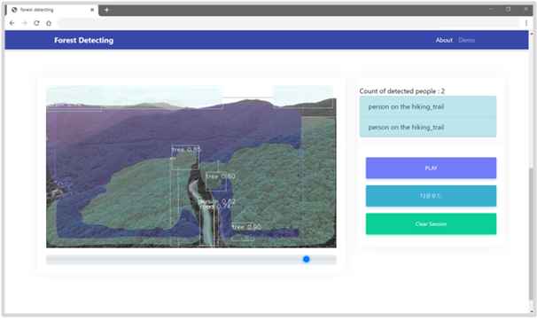

# forest-detectecting
산림지 내 딥러닝 기반 인명 수색용 객체 탐지 드론 서비스

[서비스 소개]

o 본 서비스는 드론을 활용하여 촬영한 산림지 영상 및 AI 학습용 데이터셋을 활용하여 사고위험지역 및 등산로 등을 중심으로 주변 물체(사람, 바위 등)와 영역(숲, 등산로, 풀숲 등)을 검출 및 분류하는 학습 모델을 개발하고, 해당 모델을 활용하여 산림지 영상 화면에서 검출되는 사람의 위치, 특징 등을 판별하여 알려주는 실증 서비스입니다.

o 산림지 실증 서비스 모델은 정해진 형태가 없는 개체(숲, 등산로, 바위 등)들이 많이 분포하는 산림지 영상의 특성에 따라 객체 검출(Object Detection)과 영역 분할(Segmentation)이 동시에 가능한 Mask R-CNN 모델을 기반으로 합니다.

o 서비스 모델 개발을 위해 산림지 영상에서 나타나는 주요 개체들을 총 9개의 클래스로 분류하여 학습하였으며, 학습된 모델은 산림지 영상에서 정의된 클래스 개체들을 검출하고, 검출된 각 개체들의 영역을 분할하여 형태를 인지할 수 있도록 합니다.

o 본 서비스는 드론이 촬영한 영상에서 산림지 인명 수색이 가능한 서비스를 실증하기 위해 구축한 것으로, 사용자가 서비스가 제공되는 웹 사이트에서 직접 산림지 관련 영상을 업로드하여, 해당 영상의 각 화면마다 사람이 몇 명인지, 사람들이 어떤 영역에 위치하고 있는지 등에 대한 정보를 확인할 수 있으며, 검출 결과에 대한 영상을 다운로드 할 수 있습니다.

o 
